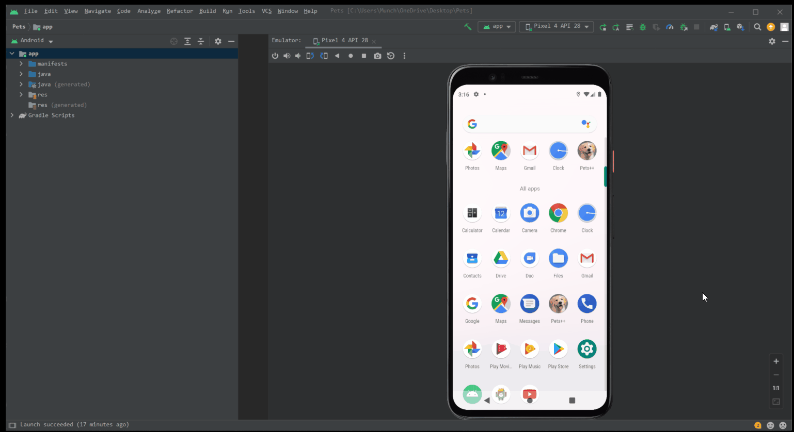
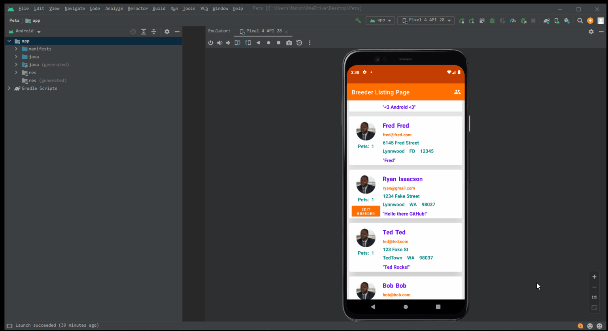

# PetsPlusPlus
## Introduction:
An application for animal breeders and animal lovers to connect! Simply create an account to login and begin editing your own information as a potential breeder. Once your credentials are how you want them, add new pets to your collection so that you can share their information with the world!

## What the App Looks Like:
To sign into the application you will just need to input an email address of your choosing to create an account, otherwise use a pre-existing email:

Once you are logged in you can see your account tile because it has the orange "Edit Breeder" button. You can edit your tile information by clicking this button.

Once you have edited your Breeder information you can then add a pet to your collection:

Note that when viewing other breeders (users), their tiles will only display their pets and pertaining information.

## Technologies Used:
Written in Kotlin.
Using FireBase for data storage.
This was both author's first project using Android Studio.

## Authors:
https://github.com/Munchinator6354 - Ryan Isaacson  
https://github.com/Ilcaelum - Jim Osburn 
https://github.com/Weegee847 - Chidera Mbara  
